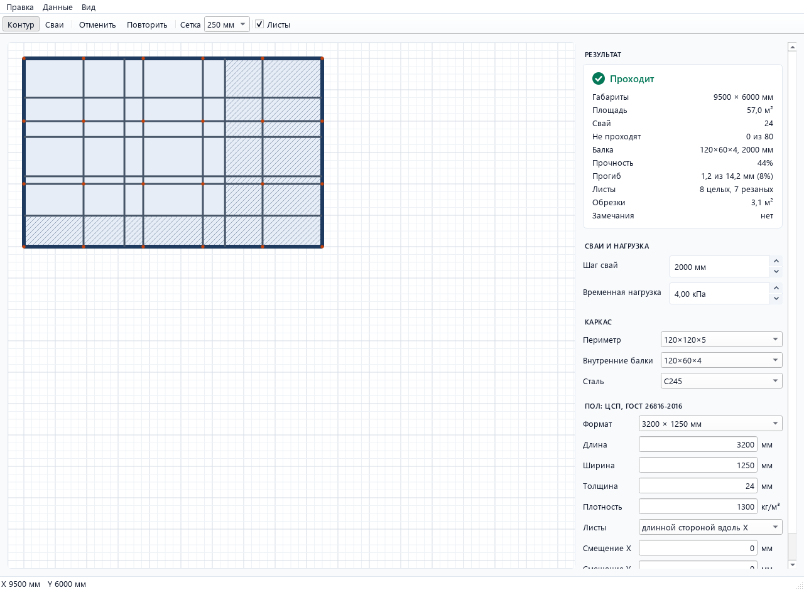

# Каркас на сваях

Desktop-приложение для проектирования металлокаркаса пола на винтовых сваях. Рисуешь план,
программа расставляет сваи, собирает каркас из профильных труб и проверяет его по нормам.

Делаю его под реальный сценарий: заготовочное производство сети ресторанов с холодильной камерой
и кондитерским цехом, пол из ЦСП по металлическому каркасу. Проект в разработке, план работ
в [Issues](https://github.com/Devilgish/pile-frame-designer/issues).

> Это инструмент для предпроектной проработки, а не проект. Результаты нужно подтверждать
> расчётом проектировщика.

## Что уже работает



- Контур плана любой ортогональной формы: протягиваешь прямоугольник или кликаешь по вершинам,
  каждая новая сторона сама становится горизонтальной или вертикальной. Самопересекающийся
  контур не принимается, в строке состояния видна причина.
- Сваи расставляются автоматически по осям через все углы контура, дальше их можно добавлять,
  двигать и удалять мышью. Все действия отменяются (Ctrl+Z) и повторяются (Ctrl+Y).
- Каркас в одной плоскости: периметр из трубы 120×120×5 идёт по сторонам контура, внутренние
  балки 120×60×4 соединяют соседние сваи на одной линии и не перекидываются через вырезы.
- Каждая балка проверяется на прочность и прогиб. Перегруженные балки, сваи вне контура и углы
  без свай видны на плане и перечислены в карточке результата.
- Раскладка листов ЦСП ровной сеткой: ориентация, смещение сетки и зазор задаются в панели.
  Под каждым стыком автоматически появляется балка 120×60, если рядом нет балки по сваям;
  листы у контура обрезаются, в карточке видно число целых и резаных листов и площадь обрезков.
- Светлая и тёмная темы, шаг сетки 50 / 100 / 250 / 500 мм.
- Исходные данные в панели: профили периметра и внутренних балок из справочника ГОСТ 30245
  (можно добавить свои), сталь С235 / С245 / С255 / С355, формат, толщина и плотность ЦСП.
  Ошибка в данных показывается под полем, отступление от ГОСТ 26816 — предупреждением.

## Как считается

- Ry стали по толщине стенки профиля (СП 16.13330.2017, таблица В.3), E = 2,06·10⁵ Н/мм², γc = 1.
- Нагрузки по СП 20.13330.2016: вес ЦСП (γf 1,2), собственный вес профиля (γf 1,05),
  временная нагрузка на пол (γf 1,3 при < 2,0 кПа, иначе 1,2).
- Прогиб от постоянной нагрузки и 0,35 временной, предел по таблице Д.1 с линейной интерполяцией.

Пока балки считаются однопролётными, а грузовая ширина берётся как половина расстояний до соседних
параллельных балок.
Неразрезные балки, срез, устойчивость стенок, швы и реакции на сваи будут в следующих задачах.

## Как запустить

```bash
python -m venv .venv
.venv\Scripts\activate
pip install -e ".[dev]"
python -m pile_frame
```

## Разработка

```bash
pytest                              # тесты с покрытием
ruff check src tests                # линтер
ruff format --check src tests       # форматирование
```

Эталонные значения в тестах расчёта посчитаны вручную и записаны в комментариях к тестам.

## Лицензия

MIT
