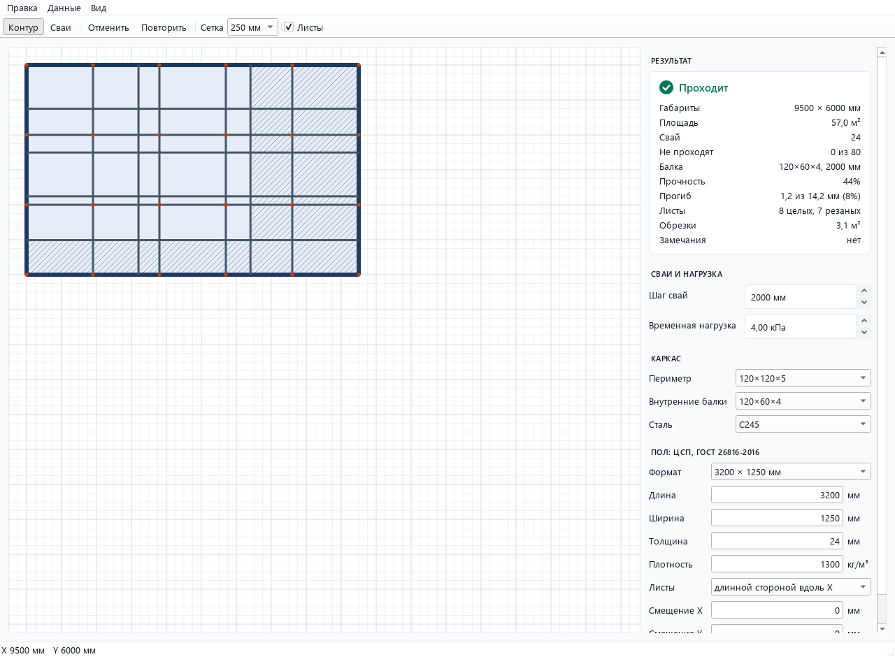
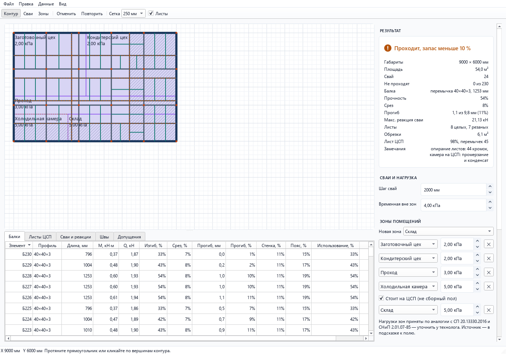
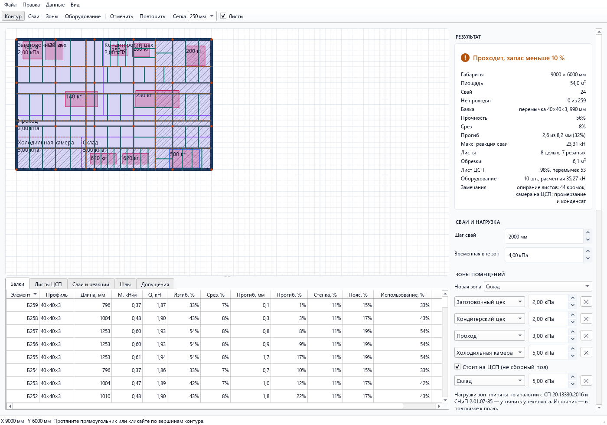
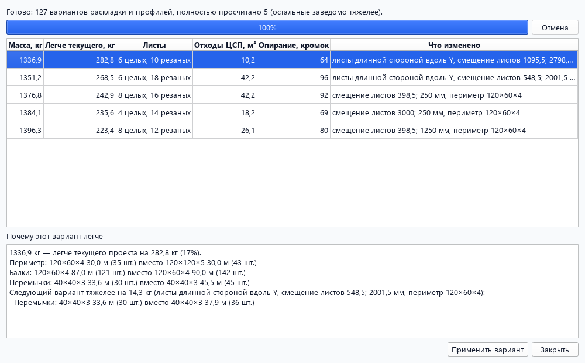
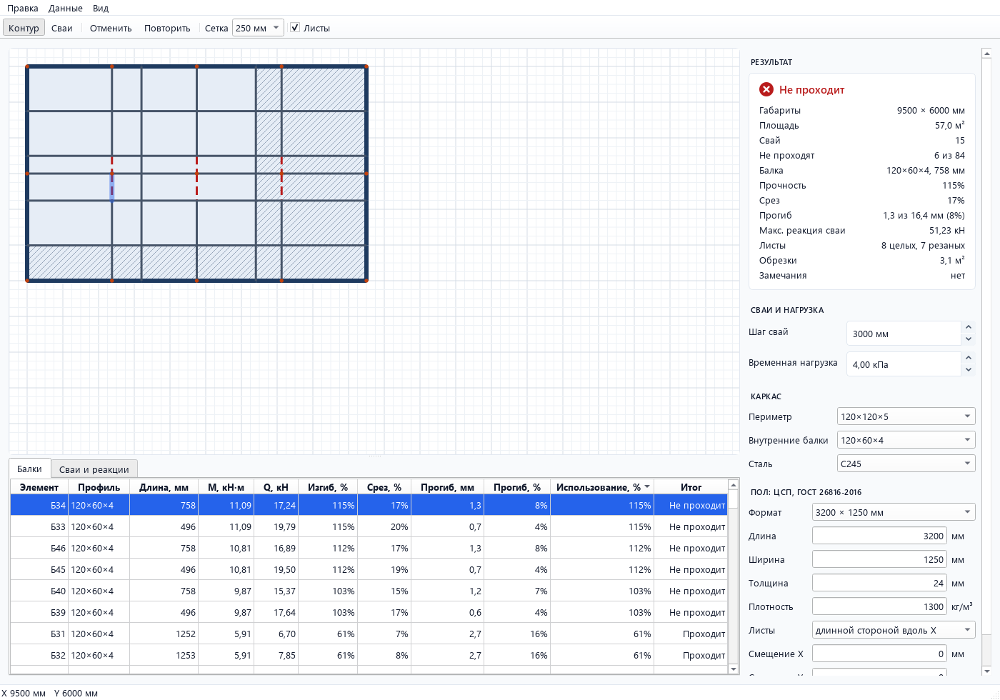
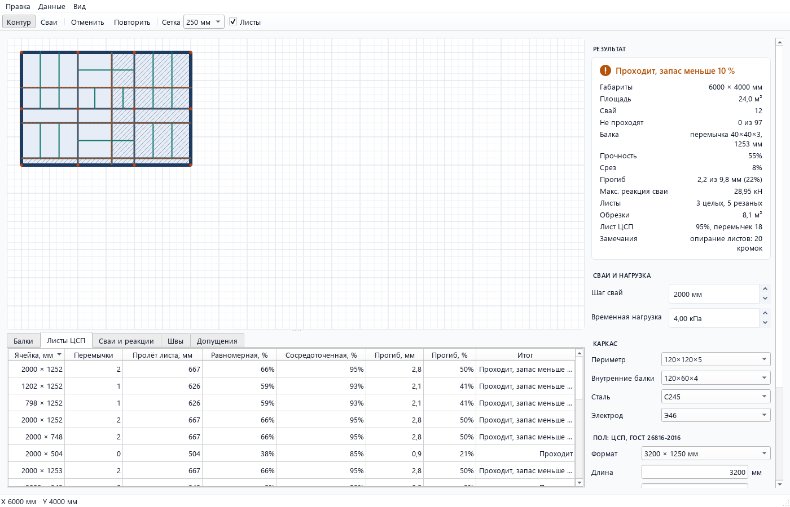
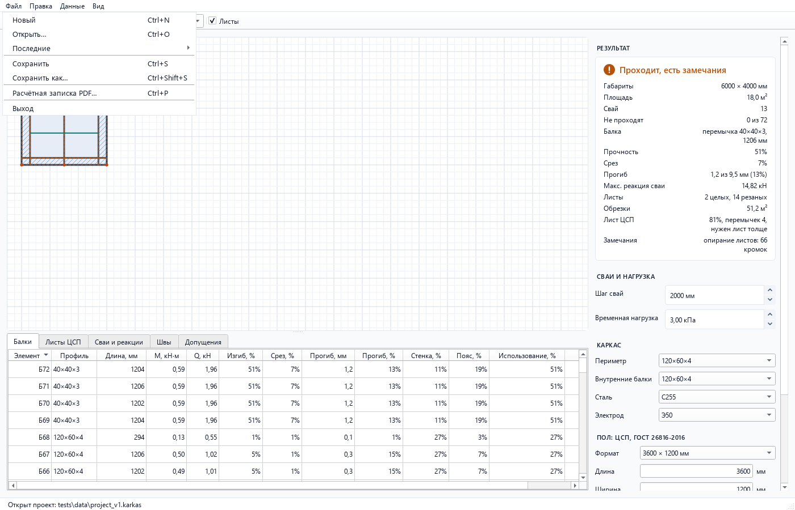
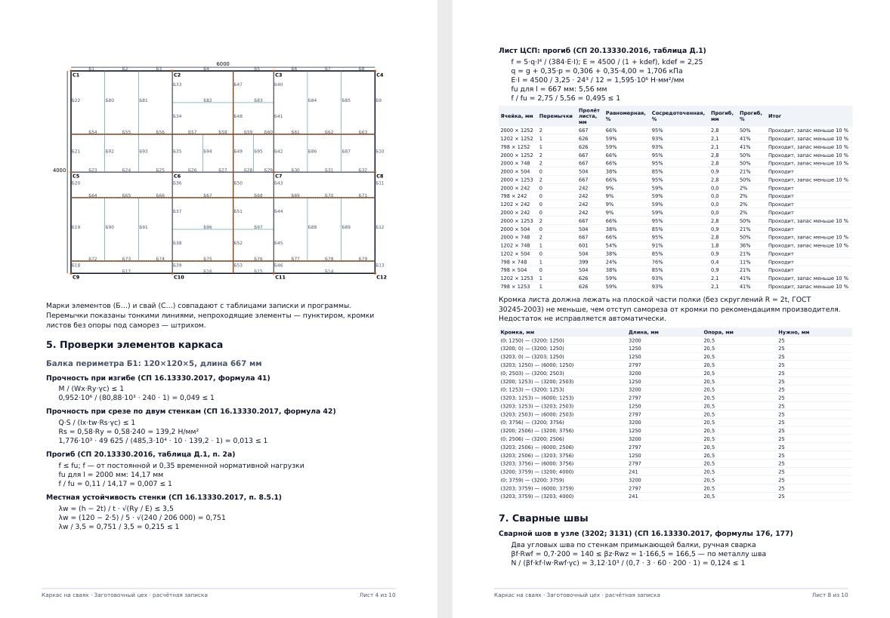

# Каркас на сваях

Desktop-приложение для проектирования металлокаркаса пола на винтовых сваях. Рисуешь план,
программа расставляет сваи, собирает каркас из профильных труб и проверяет его по нормам.

Делаю его под реальный сценарий: заготовочное производство сети ресторанов с холодильной камерой
и кондитерским цехом, пол из ЦСП по металлическому каркасу. Проект в разработке, план работ
в [Issues](https://github.com/Devilgish/pile-frame-designer/issues).

> Это инструмент для предпроектной проработки, а не проект. Результаты нужно подтверждать
> расчётом проектировщика.

## Что уже работает



- Контур плана любой ортогональной формы: протягиваешь прямоугольник или кликаешь по вершинам,
  каждая новая сторона сама становится горизонтальной или вертикальной. Самопересекающийся
  контур не принимается, в строке состояния видна причина.
- Сваи расставляются автоматически по осям через все углы контура, дальше их можно добавлять,
  двигать и удалять мышью. Все действия отменяются (Ctrl+Z) и повторяются (Ctrl+Y).
- Каркас в одной плоскости: периметр из трубы 120×120×5 идёт по сторонам контура, внутренние
  балки 120×60×4 соединяют соседние сваи на одной линии и не перекидываются через вырезы.
- Каждая балка проверяется на прочность и прогиб. Перегруженные балки, сваи вне контура и углы
  без свай видны на плане и перечислены в карточке результата.
- Раскладка листов ЦСП ровной сеткой: ориентация, смещение сетки и зазор задаются в панели.
  Под каждым стыком автоматически появляется балка 120×60, если рядом нет балки по сваям;
  листы у контура обрезаются, в карточке видно число целых и резаных листов и площадь обрезков.
- Светлая и тёмная темы, шаг сетки 50 / 100 / 250 / 500 мм.
- Исходные данные в панели: профили периметра и внутренних балок из справочника ГОСТ 30245
  (можно добавить свои), сталь С235 / С245 / С255 / С355, формат, толщина и плотность ЦСП.
  Ошибка в данных показывается под полем, отступление от ГОСТ 26816 — предупреждением.

## Зоны помещений



- Инструмент «Зоны»: протягиваешь прямоугольник, он обрезается по контуру. Зоны не могут
  накладываться друг на друга и уходить за внутренний угол контура, причина показывается
  в строке состояния.
- Назначения с пресетами временной нагрузки: заготовочный и кондитерский цех по 2,0 кПа
  (СП 20.13330.2016, табл. 8.3, п. 3 «кухни общественных зданий»), проход 3,0 (п. 12а), склад
  и холодильная камера по 5,0 (по аналогии с книгохранилищами, СНиП 2.01.07-85, табл. 3, п. 5).
  Всё помечено «принято по аналогии, уточнить у технолога», источник виден в подсказке.
- Назначение меняется одним выбором в списке (нагрузка становится пресетом), нагрузку можно
  поправить вручную. Каркас пересчитывается сразу, зоны входят в отмену и повтор.
- Нагрузка зоны идёт на балки той частью «конверта», которая попала в зону, со своим γf. Вне зон
  действует общая временная нагрузка. Лист и перемычки в ячейке считаются по самой тяжёлой
  зоне, которая её касается.
- Для холодильной камеры можно отметить «стоит на ЦСП», тогда появляется предупреждение
  о промерзании и конденсате.
- Зоны сохраняются в файле проекта (формат 2, старые файлы обновляются миграцией) и попадают
  в записку: таблица нагрузок с источниками и зоны на схеме плана.

## Оборудование



- Библиотека типовых позиций заготовочного производства: пароконвектомат, печь, плита,
  тестомес, миксер, тестораскатка, холодильный шкаф, шкаф шоковой заморозки, стеллаж, стол,
  моечная ванна. У каждой габарит, собственная масса и рабочая загрузка; значения типовые,
  с пометкой «уточнить по паспорту». Свои позиции добавляются в «Библиотеку…» и запоминаются.
- Инструмент «Оборудование»: клик ставит выбранную позицию, перетаскивание двигает, R
  поворачивает на 90°, правый клик или Delete удаляет. Оборудование стоит целиком внутри
  контура; на границе зон его вес от зон не зависит.
- Вес идёт на балки равномерно по габариту тем же «конвертом», что и зоны, сверх временной
  нагрузки (СП 20.13330.2016, п. 8.1.1). γf 1,05 для собственной массы и 1,2 для загрузки
  (табл. 8.2), в прогиб — целиком. Сумма реакций растёт ровно на расчётный вес, это проверяется
  тестом. Лист в ячейке считается с давлением стоящего в ней оборудования.
- Расчётная нагрузка от оборудования — отдельной строкой в карточке и в таблице нагрузок записки;
  оборудование сохраняется в файле проекта (формат 3) вместе со своими позициями библиотеки.

## Оптимизация по массе металла



«Данные → Оптимизация по массе металла…» перебирает ориентацию листов, смещение их сетки
(шаг 250 мм и положения, при которых стык ложится на ось свай), профили периметра и
внутренних балок той же высоты и точечные усиления: непроходящая балка заменяется более
тяжёлым профилем, и схема пересчитывается. Перемычки ставятся автоматически.

- В выдаче только варианты, которые проходят все проверки. Они сравниваются в таблице: масса,
  выигрыш против текущего проекта, листы, отходы ЦСП (видны, но в цель не входят), замечания
  по опиранию, что изменено.
- Для выбранного варианта объясняется, почему он легче: метры и штуки по типам элементов
  против текущего проекта и против следующего варианта.
- «Применить вариант» меняет параметры одним действием, «Отменить вариант» возвращает прежние.
- Перебор идёт в фоне с прогрессом и отменой. Ветви и границы: масса геометрии считается без
  расчёта и служит нижней оценкой (усиления только добавляют металл), поэтому полностью
  просчитываются единицы вариантов из сотен; тест сравнивает результат с полным перебором.
- Грильяж решается на разреженных матрицах (scipy): расчёт плана 18 × 12 м — около 0,5 с.

## Как считается





- Каркас — перекрёстная система балок (грильяж): каждая линия балок неразрезная, в пересечениях
  балки сварены и прогибаются вместе, сваи — шарнирные опоры. Кручение труб в запас не учитывается.
  Решается методом конечных элементов на numpy.
- Нагрузка с пола передаётся на балки методом «конверта»: в каждой ячейке линии под 45°, на короткие
  стороны — треугольники, на длинные — трапеции. Сумма реакций свай равна полной нагрузке, это
  проверяется тестом.
- Нагрузки по СП 20.13330.2016: вес ЦСП (γf 1,2), собственный вес профиля (γf 1,05), временная
  нагрузка на пол (γf 1,3 при < 2,0 кПа, иначе 1,2).
- Проверки по СП 16.13330.2017: прочность при изгибе (формула 41), срез по двум стенкам
  (формула 42, Rs = 0,58·Ry), Ry по толщине стенки (таблица В.3), E = 2,06·10⁵ Н/мм², γc = 1.
- Прогиб от постоянной и 0,35 временной нагрузки, предел по таблице Д.1 для меньшей стороны ячейки
  свай, с линейной интерполяцией.
- Результаты по каждой балке и реакции свай — в таблицах под планом; клик по строке выделяет балку.

- Местная устойчивость стенки (п. 8.5.1, λw ≤ 3,5) и поясного листа (формула 98) по каждой балке.
- Угловые швы в каждом узле, где одна линия балок опирается на другую: ручная сварка, Э46,
  расчёт по металлу шва или границы сплавления (формулы 176, 177). Выбор электрода проверяется по
  п. 14.1.8: для С245 электрод Э42 не подходит, и программа об этом предупреждает.
- Лист ЦСП между балками: изгиб от равномерной нагрузки, от сосредоточенной 1,5 кН на площадке
  10×10 см (СП 20.13330.2016, п. 8.3.4; в листе — решение Тимошенко для пластины) и прогиб
  с ползучестью. Прочность и модуль упругости по ГОСТ 26816-2016. Расчётной нормы на ЦСП нет,
  поэтому kmod, γm и kdef взяты по аналогии с EN 1995-1-1 и вынесены в «Допущения».
- Где лист не проходит, в ячейку автоматически ставятся перемычки 40×40×3 поперёк длинной
  стороны, ровно столько, сколько нужно. Перемычки входят в общую схему, проверяются сами
  (в том числе на сосредоточенную нагрузку посередине), их концы проверяются как сварные узлы.
- Опирание листов: кромка должна лежать на плоской части полки (без скруглений R = 2t по
  ГОСТ 30245) не меньше отступа самореза по рекомендациям производителя ЦСП. Например, листу
  24 мм нужно 25 мм, а на полке 60 мм остаётся 20,5. Такие кромки отмечаются на плане пунктиром.
- Всё, что не проверяется, и принятые упрощения — на вкладке «Допущения».

## Проект в файле



- «Файл → Новый / Открыть / Сохранить / Сохранить как» (Ctrl+N, Ctrl+O, Ctrl+S, Ctrl+Shift+S)
  и список последних файлов. Несохранённые правки отмечены звёздочкой в заголовке; при закрытии
  программа спрашивает, сохранить ли их.
- Проект хранится в файле `.karkas`: это JSON с версией формата. Старые файлы при открытии
  проходят цепочку миграций до текущей версии; эталонный файл первой версии лежит в
  `tests/data` и открывается тестом.
- Свои профили вшиваются в файл: на другом компьютере недостающий профиль добавляется в
  справочник, а конфликт по имени не затирает ни справочник, ни данные файла.
- В файл пишется короткая сводка результата. Если после открытия пересчёт дал другие числа
  (например, после обновления программы), появляется предупреждение.
- Повреждённый, чужой или созданный более новой версией файл открывается с понятным сообщением
  о причине, а не роняет программу.

## Расчётная записка



«Файл → Расчётная записка PDF…» (Ctrl+P): программа спрашивает объект и исполнителя
и сохраняет записку в PDF.

- Титул, содержание, нумерация «Лист N из M» на каждой странице.
- Исходные данные и таблица нагрузок: нормативное значение, γf, расчётное, пункт СП 20.13330.2016.
- Схема плана с марками элементов (Б…) и свай (С…), те же марки, что в таблицах программы.
- Для самого загруженного элемента каждого типа (периметр, балка, перемычка), самой загруженной
  ячейки листа и самого загруженного шва каждая проверка расписана полностью: формула с пунктом
  норм, подставленные числа, результат.
- Остальные элементы, ячейки, швы и реакции свай даны таблицами. Строки таблиц строятся тем же
  кодом, что и таблицы в окне, а тест сверяет записку с окном.
- В конце раздел «Что не проверяется и принятые упрощения» и оговорка, что записка не заменяет проект.

Вёрстка на reportlab, шрифт DejaVu Sans встроен в пакет (лицензия в `src/pile_frame/fonts`).

## Как запустить

```bash
python -m venv .venv
.venv\Scripts\activate
pip install -e ".[dev]"
python -m pile_frame
```

## Разработка

```bash
pytest                              # тесты с покрытием
ruff check src tests                # линтер
ruff format --check src tests       # форматирование
```

Эталонные значения в тестах расчёта посчитаны вручную и записаны в комментариях к тестам.

## Лицензия

MIT
